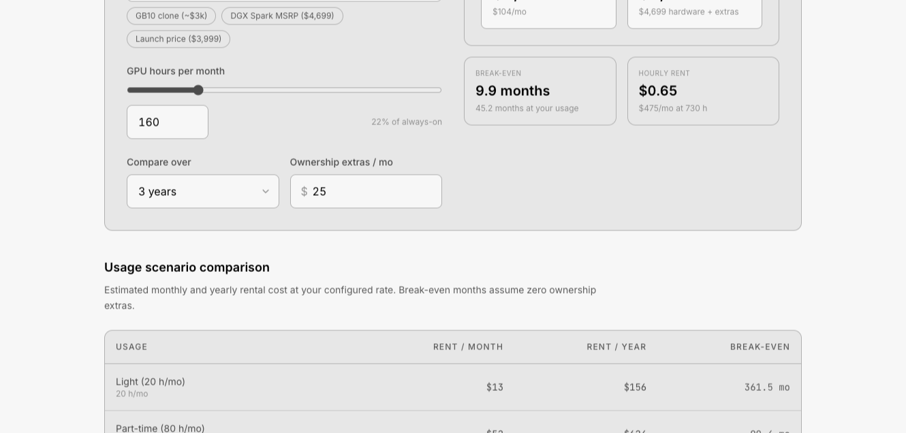

# DGX Spark Rent vs Buy Calculator

Minimal, unbranded, embeddable calculator for comparing cloud GPU rental vs hardware purchase. MIT licensed.

**Live:** https://tudormunteanu.github.io/dgx-rent-vs-buy-calculator/

[](https://tudormunteanu.github.io/dgx-rent-vs-buy-calculator/)

Adapts to light and dark mode via `prefers-color-scheme`. Grayscale palette from [grayscale.design](https://grayscale.design/app).

## Embed on your site

```html
<iframe
  src="https://tudormunteanu.github.io/dgx-rent-vs-buy-calculator/"
  title="DGX Spark rent vs buy calculator"
  width="100%"
  height="900"
  style="border:0;border-radius:12px"
  loading="lazy"
></iframe>
```

### Auto-resize iframe (optional)

```html
<iframe id="calculator" src="https://tudormunteanu.github.io/dgx-rent-vs-buy-calculator/" ...></iframe>
<script>
  window.addEventListener('message', (e) => {
    if (e.data?.type === 'dgx-rent-vs-buy-calculator:resize') {
      document.getElementById('calculator').style.height = e.data.height + 'px';
    }
  });
</script>
```

## Fork for your hardware

| File | What to change |
|---|---|
| `lib/rent-vs-buy.ts` | `DEFAULT_HOURLY_RATE`, `DEFAULT_PURCHASE_PRICE`, usage scenarios |
| `styles.css` | Palette variables (or keep grayscale) |

Deploy to your own GitHub Pages: fork, enable **Settings → Pages → GitHub Actions**, push to `main`.

## Development

```bash
npm install
npm run dev
npm run build
```

GitHub Pages path preview:

```bash
VITE_BASE_PATH=/dgx-rent-vs-buy-calculator/ npm run build && npm run preview
```

## DGX Spark rental providers

Neutral list of GB10 / DGX Spark rental options (cloud SSH access and physical). Plug any hourly rate into the calculator above.

### Cloud access (remote SSH)

| Provider | Region | Model | Notes |
|---|---|---|---|
| [Enverge Spark](https://spark.enverge.ai) | EU, UK, US | Hourly | From ~$0.65/hr, pay-as-you-go |
| [gb10 studio](https://gb10.stdio/) | — | Hourly | Dedicated GB10 cloud |
| [VFX Now](https://vfxnow.com/product/nvidia-dgx-spark/) | US | Monthly | Cloud access only |
| [Primcast](https://primcast.com/spark) | — | Monthly | Dedicated hosting, not hourly |
| [Scan](https://www.scan.co.uk/products/1-week-scan-cloud-access-nvidia-dgx-spark-personal-ai-supercomputer-gb10-blackwell-superchip) | UK | Weekly / monthly | Cloud access only (no hardware shipped) |

### Physical rental / leasing (hardware shipped)

| Provider | Region | Notes |
|---|---|---|
| [HardSoft](https://store.hardsoftcomputers.co.uk/product/nvidia-dgx-spark-supercomputer/) | UK | Leasing; hardware shipped to you |

Know another option? [Open an issue](https://github.com/tudormunteanu/dgx-rent-vs-buy-calculator/issues) or send a PR.

## License

MIT — see [LICENSE](LICENSE).
